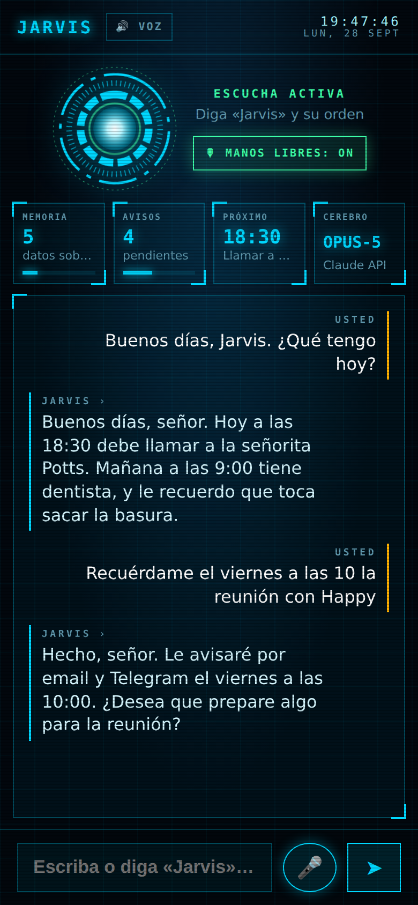
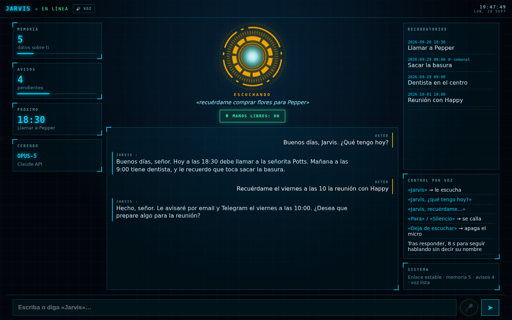

# 🤖 J.A.R.V.I.S. — tu asistente personal, como el de Tony Stark

Un asistente con inteligencia artificial que **vive en un servidor 24 horas al día**, **tiene memoria propia**, **manda emails** y **te avisa de tus cosas importantes**.
Se controla **por voz, sin tocar nada**: dices *«Jarvis, …»* y te responde hablando. También puedes escribirle desde el navegador o **desde el móvil por Telegram**.

- ✅ **100 % código abierto** (licencia MIT): úsalo, cámbialo o compártelo gratis.
- ✅ **Todo el programa ocupa un archivo de unas 170 líneas** ([`jarvis.py`](jarvis.py)) más una página web ([`index.html`](index.html)).
- ✅ **Control por voz manos libres** con palabra de activación, como en las películas.
- ✅ **Puede ser 100 % gratis**: si no quieres pagar, usa la IA gratuita en tu propio ordenador ([ver cómo](#-opción-100--gratis-sin-pagar-nada)).
- ✅ **Completamente personalizable**: nombre, personalidad, idioma, zona horaria, voz, informe diario… todo en un solo archivo de texto.

<p align="center"> &nbsp; </p>

La interfaz es un **HUD estilo Iron Man** pensado primero para el móvil. El reactor cambia de color según lo que hace Jarvis:

| Reactor | Estado | Qué significa |
|---|---|---|
| 🔵 Azul, lento | EN ESPERA | Manos libres apagado. Escríbele o pulsa 🎤. |
| 🟢 Anillo verde | ESCUCHA ACTIVA | Manos libres encendido: espera a que digas «Jarvis». |
| 🟠 Naranja | ESCUCHANDO | Te está escuchando. Debajo ves en directo lo que entiende. |
| 🔵 Gira rápido | PROCESANDO | Está pensando la respuesta. |
| 🔵 Núcleo latiendo | HABLANDO | Te está respondiendo en voz alta. |

Además tiene reloj, paneles con tu memoria y tus avisos en vivo, el chat y, en el ordenador, la lista de recordatorios y una chuleta de comandos de voz.

---

## 🧠 ¿Qué sabe hacer?

| Le dices… | Jarvis… |
|---|---|
| 🎙 *"Jarvis, ¿qué tengo hoy?"* (sin tocar el móvil) | Te **responde hablando** y sigue escuchando unos segundos por si quieres añadir algo. |
| *"Recuerda que mi mujer se llama Pepper y le encantan las fresas"* | Lo guarda en su **memoria permanente** y lo tendrá en cuenta siempre. |
| *"Avísame mañana a las 9 de que tengo dentista"* | Crea un **recordatorio** y a las 9:00 te llega un **email** (y un Telegram). |
| *"Recuérdame cada lunes a las 8 que saque la basura"* | Recordatorio **repetitivo** (diario o semanal). |
| *"Manda un email a Happy diciendo que llego tarde"* | **Escribe y envía el email** por ti. |
| *"¿Qué tiempo hace hoy en Madrid?"* / *"¿Qué ha pasado hoy en las noticias?"* | **Busca en internet** y te lo resume. |
| *(nada, cada mañana)* | Te envía un **informe del día** con tus recordatorios y lo importante. |
| *"Olvida lo de las fresas"* | Borra ese dato de su memoria. |

---

## 📋 Qué necesitas (10 minutos)

1. **Un "cerebro" (la IA)**. Dos opciones:
   - **Gratis**: tu propio ordenador con Ollama → ve a [Opción 100 % gratis](#-opción-100--gratis-sin-pagar-nada) y sáltate este punto.
   - **De pago, la más lista**: una clave de API de Claude. Entra en [console.anthropic.com](https://console.anthropic.com), crea una cuenta, añade saldo y pulsa **"API Keys → Create Key"**. Copia la clave (empieza por `sk-ant-`).
2. **Un email para enviar avisos** (opcional pero recomendado). Con Gmail:
   - Activa la [verificación en dos pasos](https://myaccount.google.com/security).
   - Crea una **[contraseña de aplicación](https://myaccount.google.com/apppasswords)** (16 letras). Esa es la que usarás, **no** tu contraseña normal.
3. **Telegram** (opcional, para hablar con Jarvis desde el móvil): habla con [@BotFather](https://t.me/BotFather), escribe `/newbot`, ponle nombre y copia el **token** que te da.
4. **Un sitio donde dejarlo encendido** (ver abajo): tu ordenador, una Raspberry Pi o un servidor en la nube (desde ~4 €/mes).

---

## 🚀 Instalación

### Paso 1 — Descarga y configura

```bash
git clone https://github.com/ConguitoXD/Jarvis.git
cd Jarvis
cp config.example.json config.json
```

Abre `config.json` con cualquier editor de texto (Bloc de notas, TextEdit, nano…) y rellena como mínimo:

- `"api_key"`: tu clave de Claude (o déjala vacía si usas el modo gratis).
- `"owner"` y `"owner_email"`: tu nombre y el email donde quieres recibir los avisos.
- `"web_password"`: una contraseña para entrar en la web de Jarvis (sin tildes ni ñ).
- La sección `"email"` con tu Gmail y la contraseña de aplicación.

### Paso 2 — Ponlo en marcha

**Opción A: con Docker (recomendado para 24/7)** — Instala [Docker](https://docs.docker.com/get-docker/) y ejecuta:

```bash
docker compose up -d
```

Listo. Jarvis se **reinicia solo** si se cae o si se reinicia el servidor, y su memoria se guarda en la carpeta `data/`.

**Opción B: con Python directamente** — Instala [Python 3.10 o superior](https://www.python.org/downloads/) y ejecuta:

```bash
pip install -r requirements.txt
python jarvis.py
```

### Paso 3 — Háblale

- **Navegador (con voz)**: abre `http://localhost:8000` (o `http://IP-DE-TU-SERVIDOR:8000`). Usuario: `jarvis`, contraseña: la que pusiste. Pulsa **🎙 MANOS LIBRES** y dile *«Jarvis, …»*. Más detalles en la sección «Control por voz» más abajo.
- **Telegram**: escribe a tu bot. La primera vez te dirá tu *chat id*; ponlo en `"allowed_chats": [123456789]` en `config.json` y reinicia. Así **solo tú** puedes usarlo.
- **Terminal**: `python jarvis.py chat`.

---

## 🆓 Opción 100 % gratis (sin pagar nada)

¿No tienes dinero para pagar la API? No pasa nada: Jarvis puede usar una **IA gratuita que funciona dentro de tu propio ordenador** gracias a [Ollama](https://ollama.com). Sin cuentas, sin tarjeta, sin límites de uso y **tus conversaciones nunca salen de tu casa**.

| | 🆓 Gratis (Ollama en tu PC) | 💳 De pago (Claude) |
|---|---|---|
| Coste | 0 € (solo la luz del ordenador) | Unos euros al mes según uso |
| Inteligencia | Buena para el día a día | La mejor |
| Buscar en internet | ❌ | ✅ |
| Memoria, recordatorios, emails, Telegram, voz | ✅ | ✅ |
| Privacidad | Total: todo se queda en tu PC | Los mensajes pasan por la API de Claude |
| Necesitas | Un ordenador con **8 GB de RAM o más** | Cualquier ordenador o servidor |

### Paso a paso

1. **Instala Ollama** desde [ollama.com/download](https://ollama.com/download) (Windows, Mac o Linux). En Linux: `curl -fsSL https://ollama.com/install.sh | sh`.
2. **Descarga un modelo** (solo la primera vez; ocupa unos GB). Abre una terminal y escribe **uno** de estos, según la memoria RAM de tu ordenador:

   | Tu ordenador | Comando | `"model"` en config.json |
   |---|---|---|
   | 8 GB de RAM | `ollama pull qwen3:4b` | `"qwen3:4b"` |
   | 16 GB de RAM o más (recomendado) | `ollama pull qwen3:8b` | `"qwen3:8b"` |
   | 32 GB o una buena tarjeta gráfica | `ollama pull qwen3:14b` | `"qwen3:14b"` |

   *(Puedes usar cualquier modelo de [ollama.com/search](https://ollama.com/search?c=tools) que tenga la etiqueta **tools**, para que pueda usar sus herramientas.)*
3. **En `config.json`** pon:
   ```json
   "api_key": "",
   "base_url": "http://localhost:11434",
   "model": "qwen3:8b",
   ```
4. **Arranca Jarvis** con `pip install -r requirements.txt` y `python jarvis.py`, como en el [Paso 2](#paso-2--ponlo-en-marcha) (opción B). ¡Listo, gratis para siempre!

> 🐳 **¿Prefieres Docker?** `docker compose -f docker-compose.gratis.yml up -d` arranca Jarvis **y** Ollama juntos. Después descarga el modelo con
> `docker compose -f docker-compose.gratis.yml exec ollama ollama pull qwen3:8b`. (En este modo no hace falta tocar `base_url`.)
> En Windows y Mac es más rápido instalar Ollama normal (usa tu tarjeta gráfica); Docker es ideal para servidores Linux.

### Tener tu ordenador como servidor 24 h, gratis

- **Que no se duerma**: en Windows, *Configuración → Sistema → Inicio/apagado → Suspender: Nunca*. En Mac, *Ajustes → Batería/Energía → Evitar reposo automático*. En Linux, desactiva la suspensión en los ajustes de energía.
- **Que Jarvis arranque solo al encender el PC**:
  - Con Docker Desktop: actívale *"Start Docker Desktop when you sign in"* y ya está (Jarvis tiene `restart: always`).
  - En Windows sin Docker: pulsa `Win + R`, escribe `shell:startup` y crea ahí un archivo `jarvis.bat` con:
    ```bat
    cd /d C:\ruta\a\Jarvis
    start "" pythonw jarvis.py
    ```
  - En Linux: usa el servicio systemd que se explica en la siguiente sección. Ollama ya se instala como servicio y arranca solo.
- **Hablarle desde el móvil fuera de casa, gratis**: usa **Telegram**. Funciona sin abrir puertos del router ni configurar nada más. Si también quieres la web desde fuera, instala [Tailscale](https://tailscale.com) (gratis) en el PC y en el móvil y entra en `http://NOMBRE-DE-TU-PC:8000`.
- **Emails gratis**: con tu Gmail y una contraseña de aplicación (ver [Qué necesitas](#-qué-necesitas-10-minutos)).

> 💡 **¿No quieres dejar tu PC encendido?** [Oracle Cloud "Always Free"](https://www.oracle.com/cloud/free/) regala un servidor ARM de hasta 4 núcleos y 24 GB de RAM, suficiente para `qwen3:4b` u `qwen3:8b` (va algo más lento sin tarjeta gráfica). Crea un servidor Ubuntu y usa `docker-compose.gratis.yml`. Te pedirá una tarjeta para verificar tu identidad, pero no cobra mientras uses solo los recursos gratuitos.

---

## 🎙️ Control por voz

Jarvis funciona **solo con la voz**, sin tocar la pantalla.

1. Abre la web de Jarvis (en el móvil, tablet u ordenador) y pulsa **🎙 MANOS LIBRES**. La primera vez el navegador te pedirá permiso para usar el micrófono: acéptalo.
2. El reactor se pone con un **anillo verde**: está esperando su nombre.
3. Di **«Jarvis»** seguido de lo que quieras, todo seguido: *«Jarvis, recuérdame mañana a las 9 que tengo dentista»*.
   - O di solo **«Jarvis»**: te contestará *«¿Sí, señor?»* y tendrás 8 segundos para hablar.
4. Te responde **en voz alta**. Después sigue escuchando **8 segundos** para que puedas contestarle sin repetir su nombre, como en una conversación normal.

| Di… | Qué pasa |
|---|---|
| *«Jarvis»* | Se activa y te escucha. |
| *«Jarvis, …cualquier cosa…»* | Lo hace y te responde hablando. |
| *«Para»*, *«Silencio»*, *«Basta»* | Se calla al momento. |
| *«Deja de escuchar»* / *«Apaga el micro»* | Desactiva el modo manos libres. |

**Otras formas de usar la voz**
- **Pulsar y hablar**: con manos libres apagado, pulsa 🎤, di tu frase y listo.
- **🔊 VOZ** (arriba): si está encendido, Jarvis lee en voz alta **también** las respuestas a lo que escribes.

**Consejos**
- Mientras el modo manos libres está encendido, **la pantalla no se apaga sola**, para que Jarvis siga escuchando. Déjalo en un soporte, enchufado, y tendrás tu Jarvis de escritorio.
- Funciona en **Chrome, Edge y Safari** (móvil y ordenador). Firefox todavía no permite reconocer voz.
- Fuera de `localhost`, el micrófono **solo funciona con HTTPS** (ver la sección «Tenerlo encendido 24 horas»). Con Tailscale puedes activar HTTPS gratis con `tailscale serve`.
- Si no te entiende bien el nombre, añade cómo lo oye a la lista `wake_words` (por ejemplo `"yarvis"`). Si cambias el nombre del asistente (p. ej. `"FRIDAY"`), pon también `"wake_words": ["friday"]`.

---

## ☁️ Tenerlo encendido 24 horas

| Dónde | Cómo |
|---|---|
| **Servidor en la nube (VPS)** — Hetzner, DigitalOcean, OVH, Contabo, Oracle Cloud (tiene plan gratis)… | Crea un servidor Ubuntu, instala Docker, copia la carpeta y `docker compose up -d`. |
| **Raspberry Pi o un ordenador viejo en casa** | Igual que arriba. Consume muy poco. |
| **Railway / Render / Fly.io** | Sube el repositorio: detectan el `Dockerfile` solos. Añade un *volumen* en `/app/data` para que no pierda la memoria, sube `config.json` como archivo secreto y pon la variable de entorno `JARVIS_CONFIG` con su ruta. |
| **Sin Docker, en Linux** | Crea un servicio (ver abajo). |

<details><summary>Servicio de Linux (systemd) sin Docker</summary>

Crea `/etc/systemd/system/jarvis.service`:

```ini
[Unit]
Description=Jarvis
After=network-online.target

[Service]
WorkingDirectory=/home/TU_USUARIO/Jarvis
ExecStart=/usr/bin/python3 jarvis.py
Restart=always

[Install]
WantedBy=multi-user.target
```

Y ejecuta `sudo systemctl enable --now jarvis`.
</details>

> 🔒 **Si lo expones a internet**, usa una contraseña fuerte y, a ser posible, HTTPS (por ejemplo con [Caddy](https://caddyserver.com): `caddy reverse-proxy --from jarvis.tudominio.com --to localhost:8000`). El micrófono del navegador solo funciona con HTTPS o en `localhost`.

---

## 🎨 Personalización (`config.json`)

| Opción | Qué hace | Ejemplo |
|---|---|---|
| `name` | Nombre del asistente | `"FRIDAY"`, `"Alfred"`, `"HAL"` |
| `owner` | Cómo te llamas | `"Tony"` |
| `owner_email` | Dónde recibes los avisos | `"tony@stark.com"` |
| `language` | Idioma en el que responde | `"español"`, `"English"`, `"français"`, `"català"` |
| `timezone` | Tu zona horaria ([lista](https://en.wikipedia.org/wiki/List_of_tz_database_time_zones)) | `"Europe/Madrid"`, `"America/Mexico_City"` |
| `personality` | **Su forma de ser.** Escríbela como quieras. `{name}` y `{owner}` se sustituyen solos | `"Eres un mayordomo sarcástico…"` |
| `model` | Modelo de IA | Claude: `"claude-opus-5"` (más listo), `"claude-sonnet-5"`, `"claude-haiku-4-5"` (el más barato). Gratis: `"qwen3:8b"` |
| `base_url` | Vacío = Claude. `"http://localhost:11434"` = Ollama gratis en tu PC | `""` |
| `voice` | Ajustes de voz: `wake_words` (palabras que lo activan), `lang` (idioma de la voz, p. ej. `"es-ES"`, `"es-MX"`, `"en-US"`), `rate` (velocidad), `pitch` (tono; más bajo = más grave) y `name` (parte del nombre de una voz concreta de tu dispositivo, p. ej. `"Jorge"`) | `{"wake_words": ["jarvis"], "lang": "es-ES", "rate": 1.05, "pitch": 0.9}` |
| `history` | Cuántos mensajes recientes de la conversación recuerda | `30` |
| `briefing_time` | Hora del informe diario (vacío `""` = desactivado) | `"08:00"` |
| `briefing_prompt` | Qué quieres en tu informe diario | `"Resúmeme el día y dame una frase motivadora"` |
| `web_password` | Contraseña de la web | `"una-contraseña-larga"` |
| `port` | Puerto de la web | `8000` |
| `email` | Servidor de correo (SMTP). Gmail: `smtp.gmail.com` / `465`. Outlook: `smtp.office365.com` / `587` | |
| `telegram` | `token` del bot y lista de `allowed_chats` autorizados | |

El **aspecto del HUD** está en `index.html`: cambia los colores en las primeras líneas (`--c` es el color principal; pon `#ff3b3b` para un Jarvis rojo estilo Mark III). Para **añadirle nuevas habilidades**, copia una función con `@beta_tool` en `jarvis.py`, escribe qué hace en su descripción y añádela a la lista `TOOLS`: Jarvis aprenderá a usarla solo.

---

## ⚙️ Cómo funciona por dentro

```
   Tú (voz / web / Telegram / terminal)
                 │
                 ▼
          ┌─────────────┐      ┌──────────────────────────┐
          │  jarvis.py  │ ───▶ │ El cerebro (IA): Claude  │
          └─────────────┘ ◀─── │ u Ollama gratis. Decide  │
             │       │         │ qué herramienta usar     │
             │       │         └──────────────────────────┘
             ▼       ▼
     memory.db     Herramientas: recordar · olvidar · recordatorios ·
     (SQLite:      enviar email · buscar en internet
     memoria,
     recordatorios,     ⏰ El "vigilante" revisa cada 30 s los recordatorios
     conversación)         y te avisa por email/Telegram. Cada mañana, informe.
```

- **Memoria**: un archivo `data/memory.db` en tu propio servidor. Guarda lo que Jarvis aprende de ti, tus recordatorios y la conversación reciente. **Haz copia de seguridad de esa carpeta** y lo tendrás para siempre.
- **¿Por qué Python?** Es el lenguaje más eficiente *para esto*: el trabajo pesado lo hace la IA, y Python trae de serie base de datos, email y servidor web. Resultado: un solo archivo corto, **una sola dependencia** (el SDK oficial de Claude) y fácil de leer y modificar para cualquiera.

---

## 💶 ¿Cuánto cuesta?

El programa es **gratis**. Con el [modo gratis](#-opción-100--gratis-sin-pagar-nada) (Ollama en tu PC) **no pagas nada**. Con Claude pagas el uso de la IA a Anthropic (por uso, sin cuotas) y, si quieres, el servidor. Para un uso personal normal suelen ser unos pocos euros al mes; con `"model": "claude-haiku-4-5"` sale mucho más barato. Puedes ver y limitar el gasto en [console.anthropic.com](https://console.anthropic.com).

---

## ❓ Problemas frecuentes

- **"authentication_error" / "invalid x-api-key"** → la clave de `api_key` está mal copiada o no tienes saldo.
- **No llegan los emails** → usa la *contraseña de aplicación* de Gmail, no la normal. Revisa la carpeta de spam.
- **Los recordatorios llegan a otra hora** → revisa `timezone`.
- **El micrófono no funciona** → usa Chrome, Edge o Safari y entra por `localhost` o HTTPS. Revisa que diste permiso al micrófono (icono del candado junto a la dirección).
- **No reacciona cuando digo «Jarvis»** → comprueba que el botón pone *MANOS LIBRES: ON*. Mira debajo del reactor qué entiende y añade esa palabra a `wake_words`.
- **En Android suena un pitido cada pocos segundos** → es Chrome reiniciando la escucha. Puedes bajar el volumen de notificaciones o usar *pulsar y hablar* (🎤).
- **La voz suena rara o en otro idioma** → cambia `voice.lang` o elige otra voz con `voice.name`. Las voces disponibles dependen de tu móvil u ordenador.
- **El modo manos libres se para con el móvil en segundo plano o la pantalla bloqueada** → es una limitación de los navegadores. Déjalo con la web abierta en primer plano.
- **Telegram dice "No autorizado"** → copia el número que te da en `allowed_chats` y reinicia.
- **Modo gratis: "Connection refused"** → Ollama no está abierto. Ábrelo o ejecuta `ollama serve`.
- **Modo gratis: "model not found"** → falta descargarlo: `ollama pull qwen3:8b` (el nombre debe coincidir con `"model"`).
- **Modo gratis: va lento** → usa un modelo más pequeño (`qwen3:4b`) o cierra otros programas.
- **Ver qué está pasando** → `docker compose logs -f` (o mira la terminal donde lo lanzaste).

---

## 🔐 Privacidad y seguridad

- Tus datos (memoria, recordatorios, conversación) se guardan **solo en tu servidor**. Con Claude, los mensajes se envían a su API para generar las respuestas; en el modo gratis con Ollama, **nada sale de tu ordenador** (salvo los emails y Telegram que tú actives).
- **Voz:** el reconocimiento de voz lo hace tu navegador. Chrome y Edge envían el audio a los servidores de Google o Microsoft para transcribirlo; Safari puede hacerlo en el propio dispositivo. La voz de Jarvis se genera en tu dispositivo. El micrófono solo está activo con *manos libres* encendido o al pulsar 🎤.
- `config.json` contiene tus contraseñas: **nunca lo subas a GitHub** (ya está en `.gitignore`).
- Jarvis puede enviar emails en tu nombre; está instruido para confirmar contigo antes, salvo que se lo pidas claramente.

---

## 🌍 English (short version)

A self-hosted, fully customizable Tony-Stark-style AI assistant in **one ~170-line Python file**: persistent memory (SQLite), email sending, scheduled reminders and a daily briefing delivered by email/Telegram, web search, and an Iron-Man-style HUD with **hands-free voice control** (say *"Jarvis, …"* and it answers out loud; say *"stop"* to silence it). Setup: `cp config.example.json config.json`, fill in your Claude API key, email (SMTP) and password, set `"language": "English"`, then `docker compose up -d` (runs 24/7, auto-restarts) or `pip install -r requirements.txt && python jarvis.py`. Open `http://localhost:8000` (user `jarvis`). **Free mode, no API costs:** install [Ollama](https://ollama.com), run `ollama pull qwen3:8b`, and set `"base_url": "http://localhost:11434"` and `"model": "qwen3:8b"` in `config.json` (or use `docker compose -f docker-compose.gratis.yml up -d`). Everything runs on your own computer. MIT licensed.

---

## 🤝 Contribuir

¿Ideas, errores o mejoras? Abre un *issue* o un *pull request*. Todo el código está aquí, a la vista, para que cualquiera lo entienda y lo mejore.

**Licencia:** [MIT](LICENSE) — libre para todo el mundo.
